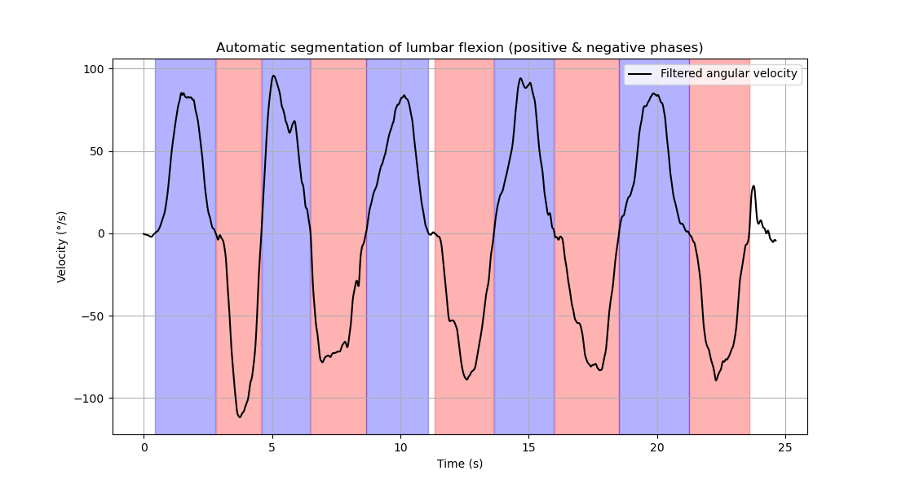

# R and Python project for Master’s internship 
_____________
# Movement smoothness as a subclinical marker in low back pain -  is whole signal analysis appropriate ? 

# Scientific problem

## Context

Low back pain represents the leading cause of disability worldwide. At the individual level, low back pain has substantial consequences, including activity limitations (1) as well as spinal kinematic alterations (2).

Movement smoothness has a potential to provide valuable information about sensorimotor control and to support patient assessment. It reflects the degree to which a movement is performed continuously without interruption, independently of its amplitude or duration(3). In this context, we are leading a study to evaluate **the evolution of movement smoothness in trunck flexion before and after a rehabilitation program in individuals with low back pain**. The assesment consist in performing 5 repetitions of trunck flexion while wearing an inertial measurement unit (IMU) on the lower back.

Several methods exist to evaluate movement smoothness, including the spectral arc lenght (SPARC), the log dimensionless jerk (LDLJ), the normalized number of peaks (NPP). The SPARC method has been shown to be more valid, sensitive and robust than the other methods (3,4,5). NNP as the advantage of being less computationally intensive and easier to implement. 

In a previous work (6), Pearson (R=-0,75 ; p = 0,01) and Spearman (R=-0,8 ; p = 0,009) correlations showed a strong and significant negative association between SPARC and NNP when computed on a segmented movement. These results indicate a robust monotonic relationship between the two metrics.  

In our study, patients are asked to perform 5 repetitions of trunck flexion. So the signal is composed of 5 flexion and 5 return from flexion (extension), **Previous studies suggested that smoothness metrics (SPARC and LDLJ) should not be computed on an entire rhythmic movements** (4). However, it is not clear how strongly this issue affects the SPARC and NNP metrics during trunk flexion assessed with IMUs in individuals with low back pain. 
 
Computing smoothness metrics on the whole signal may present practical and methodological advantages. Whole-signal analysis simplifies the processing pipeline by avoiding manual or automated segmentation procedures, may better reflect the natural continuity of functional movement, and reduces the risk of losing potentially relevant information at the transition phases between repetitions.

## Aim

The aim of this methodological work is to compare whole signal and segmented signal analysis for both SPARC and NNP methods in individuals with low back pain. These results will help us to determine if the SPARC and NNP metrics calculated for the whole movement can be used as a proxy for the metrics calculated for each repetition.

## Hypothesis 

We hypothesize that this work will confirm that SPARC can't be computed on the whole signal, as it is sensitive to movement duration and structure (4). On the other hand, we expect that the NNP metric will show a stronger correlation between the whole signal and the segmented signal than the SPARC metric, due to its lower sensitivity to movement duration and structure.

### 1.3 : methods :
#### 1.3.1 : participants :
10 individuals with low back pain participated in this study. The target population consisted of adults aged between 18 to 65 years with chronic low back pain persisting for more than three months. Participants were eligible for inclusion if they had a body mass index between 18 and 30 kg/m^2 and were undergoing rehabilitation in the physical and rehabilitation medicine department of Montpellier University Hospital. 
Patients were excluded if they had (1) experienced an episode of sciatica within the previous three months, (2) low back pain of traumatic, tumoral or infectious origin, (3) an history of spinal, pelvic or hip fracture, (4) inflammatory rheumatic disease, (5) prior spinal fusion, (6) severe scoliosis, (7) inability to provide informed consent or legal protection status, (8) lack of affiliation with a social security system, (9) deprived of liberty by judicial or administrative decision, (10) concurrent participation in another research study with an ongoing exclusion period, (11) pregnancy or breastfeeding

#### 1.3.2 : data collection :
Patients were equipped with Xsens inertial sensors (Awinda) placed on the head, T8, L1, L3 and S1, with a sampling frequency of 60 Hz. Participants completed a standardized task including five repetitions each of maximal lumbar flexion and trunk rotation to the left and right, while standing with feet shoulder-width apart, knees extended. Each assessment lasted approximately 15 minutes. 

**Figure 1**: The figure above shows an example of a velocity profile computed from a patient. Flexion segments are highlighted in blue and return from flexion (extension) segments are highlighted in red. This velocity profile is used to calculate the SPARC and NNP metrics for both the whole signal and the segmented signal.

#### 1.3.3 : outcome mesured : 
Movement smoothness was evaluated based on the velocity profile given by the gyroscope. It is quantified using two metrics : SPARC and NNP. These metrics are described in detail in the Python_project

$$SPARC = - ∫ | \sqrt(((\frac{1}{wc})**2+(\frac{dV(ω)}{dω})**2) dω |$$

Where V(ω) is the Fourier magnitude spectrum of the velocity profile and ω is the angular frequency.

$$NNP = \frac{\text{number of peaks in the velocity profile}}{\text{total duration of the movement}}$$

## 2 : Python project : data analysis
### 2.1 : aim 
the aim of the python project is to extract the velocity profile from the gyroscope data, segment the movement into individual repetitions of flexion and extension and calculate the SPARC and NNP metrics for each repetition and for the whole movement. 

### 2.2 : data organisation : 
#### 2.2.1 : data structure :
"Flexion_dos_X_av.xlsx" where X is the participant number (from 1 to 10)
The file contains for each participant : 
- "General informations"
- Segment angular velocity (°/s) for each sensor (head, T8, L1, L4 and S1) in the three planes of movement.

### 2.3 : Notebook structure :
The python notebook, follows the structure :
1. Import necessary libraries
2. Load the data
3. Preprocess the data (filtering, segmentation)
4. Calculate SPARC and NNP metrics for each repetition
5. Calculate SPARC and NNP metrics for the whole movement
6. add the result to a dataframe for each participant and save it as a csv file for the next step of the project (R project : statistical analysis)

**preprocessing** : 
- Filtering : A low-pass Butterworth filter is applied to the angular velocity data to remove high-frequency noise. The cutoff frequency is 10 Hz.

- Segmentation : The movement is segmented into individual repetitions of flexion and extension using a peak detection algorithm. As the movement flexion is performed 5 times, 10 segments are expected in the velocity profile.

**calculation of SPARC and NNP** :
- SPARC : The Fourier magnitude spectrum of the velocity profile is calculated and then the SPARC metric is computed. 

- NNP : The number of peaks in the velocity profile is counted and then divided by the total duration of the movement to calculate the NNP metric.  

**output** : results are stored in a dataframe with the following columns : Signal name, mean_SPARC_flexion, mean_NNP_flexion,	SPARC, NNP. This dataframe is saved in the folder "results" as "results_all.xlsx" for the next step of the project (R project : statistical analysis).

## 3 : R project : statistical analysis
### 3.1 : aim
the aim of the R project is to compare whole signal and the segmented signal analysis for both SPARC and NNP methods in individuals with low back pain. 

### 3.2 : data organisation :
**files** : "results_all.xlsx" which contains the SPARC and NNP metrics for each participant. These metrics are calculated for both the whole signal and the segmented signal.

**columns** : Signal name,	mean_SPARC_flexion, mean_NNP_flexion, SPARC,	NNP
**Signal name** : the name of the signal (e.g. "Flexion_Dos_01) 

### 3.3 : script structure :

#### 3.3.1 : Scatter plots :
Values from the whole signal are plotted on the y-axis and values from the segmented signal are plotted on the x-axis. A regression line is added to each scatter plot to illustrate the correlation between the two metrics. The loess curve is added to capture any non-linear relationship between the two metrics. The equation of the regression line and the R-squared value are displayed on the plot to quantify the strength of the correlation. 

#### 3.3.2 : Bland-Altman plots :
Bland-Altman plots are created to assess the agreement between the whole signal and the segmented signal for both SPARC and NNP metrics. The difference between the two measurements (whole signal - segmented signal) is plotted on the y-axis against the average of the two measurements ((whole signal + segmented signal)/2) on the x-axis. The mean difference (bias) and the limits of agreement (mean difference ± 1.96 * standard deviation of the differences) are calculated and displayed on the plot. The Bland-Altman plots help to visualize any systematic bias between the two methods and to identify any potential outliers or trends in the differences across the range of measurements (7)

## References
1. Hartvigsen J, Hancock MJ, Kongsted A, Louw Q, Ferreira ML, Genevay S, et al. What low back pain is and why we need to pay attention. Lancet Lond Engl. 9 juin 2018;391(10137):2356‑67

2. Errabity A, Calmels P, Han WS, Bonnaire R, Pannetier R, Convert R, et al. The effect of low back pain on spine kinematics: A systematic review and meta-analysis. Clin Biomech. août 2023;108:106070

3. 	Balasubramanian S, Melendez-Calderon A, Roby-Brami A, Burdet E. On the analysis of movement smoothness. J Neuroengineering Rehabil. 9 déc 2015;12:112

4.  Balasubramanian S, Melendez-Calderon A, Roby-Brami A, Burdet E. On the analysis of movement smoothness. J Neuroeng Rehabil. 9 déc 2015;12:112. doi:10.1186/s12984-015-0090-9 PubMed PMID: 26651329; PubMed Central PMCID: PMC4674971.

5. Melendez-Calderon A, Shirota C, Balasubramanian S. Estimating Movement Smoothness From Inertial Measurement Units. Front Bioeng Biotechnol. 14 janv 2021;8:558771. doi:10.3389/fbioe.2020.558771

6. https://github.com/ancelingely/Projet_R_Python_M2_REHAB.git

7. Giavarina D. Understanding Bland Altman analysis. Biochem Med. 2015;25(2):141‑51. <a href="doi:10.11613/BM.2015.015" class="uri">doi:10.11613/BM.2015.015</a>
</li>

<>